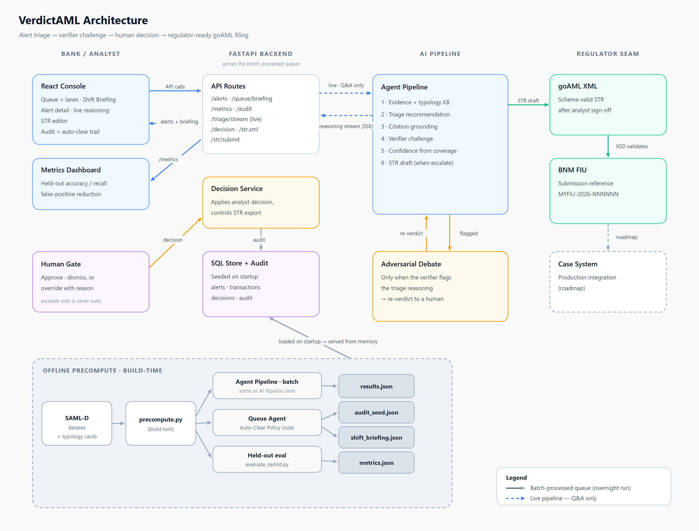

# VerdictAML — AML Alert-Triage Copilot

NexHack 2026 — Track 2: Fintech Risk & Fraud Intelligence

VerdictAML is a multi-agent system designed to assist banking anti-money laundering (AML) compliance analysts in triaging suspicious transaction alerts. Leveraging DeepSeek-v4 language models, the copilot analyzes transaction typologies, runs an adversarial verifier to challenge false-positive escalations, drafts structured Suspicious Activity Reports (STR), and reports workload-reduction metrics on a held-out synthetic transaction dataset. It also works the queue **autonomously**: before the analyst arrives, the **Queue Agent** runs every alert through this pipeline and auto-clears the high-confidence, verifier-agreed benign noise — surfacing only the alerts that need a human and never auto-filing a report (the *Autonomous AI Workforce* theme, with a human gate; ADR-0010). Once an analyst signs off on an escalation, the approved STR exports as a **schema-valid goAML XML** — the wire format Bank Negara Malaysia's Financial Intelligence Unit ingests — so the copilot is a drop-in component of the bank's existing STR submission flow, not a standalone tool.

> **🏁 Final-round submission links**
> - 📊 **Pitch deck (PDF):** [docs/VerdictAML-finals.pdf](docs/VerdictAML-finals.pdf)
> - 🌐 **Live console (Render):** https://aml-alert-triage-copilot-1.onrender.com
> - 📺 **7-min demo video (YouTube):** https://youtu.be/5_GYoHZ4b9E
>
> **📦 Prelim submission links**
> - 📺 **7-min demo video (YouTube):** https://youtu.be/5_GYoHZ4b9E
> - 📊 **Pitch deck (Google Slides):** https://docs.google.com/presentation/d/1Oo8ttmGPhU5pcUtKKO_EHwChylzOs0nc/edit?usp=sharing&ouid=111272448091501598018&rtpof=true&sd=true
> - 🌐 **Live console (Render):** https://aml-alert-triage-copilot-1.onrender.com

---

## Tech Stack

| Layer | Choices |
| :--- | :--- |
| **Backend** | Python · FastAPI |
| **Database** | PostgreSQL (Neon) · SQLite (local) |
| **Frontend** | React · TypeScript · Vite · Tailwind CSS |
| **LLM** | DeepSeek V4 — **V4 Pro** (triage + STR drafting), **V4 Flash** (adversarial verifier) |
| **Data** | SAML-D synthetic AML dataset |

---

## Architecture and Workflow

The system is split into a React-based analyst console and a Python FastAPI backend orchestrating the multi-agent pipeline. 




### Multi-Agent Pipeline Mechanics
1. **Knowledge Retrieval**: Fetches relevant typology guidance (e.g., pass-through, structuring, dormant accounts) from a curated local knowledge base.
2. **Triage Agent (DeepSeek-v4-pro)**: Matches the alert's transactions against each typology's indicators and recommends escalate/dismiss **on the pattern**. Confidence is *computed* from how many of the typology's indicators actually fired (ADR-0007), and the console surfaces that coverage as a **per-indicator checklist** beneath the score — so the number reads as earned evidence (4 of 6 red flags fired), not a figure the model asserted.
3. **Verifier Agent (DeepSeek-v4-flash)**: The **sole adversarial discriminator**. Triage matches the pattern; the verifier independently re-reads the raw evidence and challenges the call against the typology's *distinguishing test* and *benign look-alike* (e.g., a benign business sweep vs. a pass-through laundering flow), flagging borderline escalations for human review. Keeping this discrimination out of triage — rather than having both agents second-guess the same benign look-alikes — is what makes the verifier a meaningful second line instead of a redundant echo, and it is what lets the verifier reliably catch the wrong calls that triage deliberately surfaces.
4. **STR Draft Generator (DeepSeek-v4-pro)**: Generates a structured Suspicious Activity Report narrative including the activity summary and grounds for suspicion.

**Queue Agent — autonomous orchestration over the four agents (ADR-0010).** The Queue Agent runs the pipeline above across the *whole queue* offline, then a **deterministic, auditable Auto-Clear Policy** routes each alert: it auto-dismisses an alert only when `recommendation = dismiss` **and** confidence ≥ threshold **and** the verifier *agreed* (`autoCleared`), otherwise it routes to a human `needsReview` lane. There is **no new model reasoning** here — the autonomy is transparent routing on top of the agents' grounded calls, which is exactly what makes it defensible: it auto-clears the benign noise but **never auto-escalates or auto-files** (everything STR-bound reaches a human), and every autonomous clear is written to the audit trail. A precomputed **Shift Briefing** narrates the overnight run for the analyst on arrival.

### Integration Seam: goAML STR Export

The copilot is built to sit *inside* a bank's compliance estate, not beside it. Once an analyst signs off on an escalation, the approved STR exports as a **schema-valid goAML XML** — the format Bank Negara Malaysia's FIU ingests for STR e-filing — via `GET /alerts/{alertId}/str.xml`. The export is:

- **Regulator-real** — a transaction-based goAML STR report. Each cited transaction becomes a `<transaction>` with the subject account on the institution's `*_my_client` side, so the same running-balance "mule tell" the analyst saw is carried onto the regulator's wire. The matched FATF/BNM typology is emitted as a goAML `<report_indicators>` code.
- **Gated behind human sign-off** — the export unlocks only after an *escalate* disposition is recorded, recomputed live from the current decision. No STR can be filed without analyst approval, and a change-of-mind to dismiss instantly revokes it.
- **Validated before it leaves** — every document is checked against a checked-in, tightly-scoped goAML XSD before return, so a malformed report cannot be emitted. Institution-level registration (reporting-entity ID, indicator code lists) is a one-file config swap (`backend/data/goaml_config.json`), so the faithful generic schema graduates to a specific FIU's live schema without code changes.

Most AML demos stop at a drafted report; this one emits the regulator's actual filing artifact — schema-validated and human-gated. The reusable, deterministic serializer (`backend/goaml.py`) carries no LLM latency, so it is safe on the live demo path.

### Accountability: Audit Trail & Filing Acknowledgement

The bank stays the reporting institution of record, so every action is logged and every filing is acknowledged:

- **Append-only audit trail** (`GET /audit`) — each analyst decision records the **AI's recommendation, confidence, and verifier status alongside the human disposition**, so an override is accountable after the fact. Overriding the AI **requires a reason**, captured as the reason-of-record; a change-of-mind appends a new entry rather than erasing the first. Surfaced in the console's **Audit Trail** tab — the record a regulator can replay.
- **Filing acknowledgement** — filing an approved STR (`POST /alerts/{alertId}/str/submit`) validates the goAML report, records the filing in the trail, and returns a **FIU submission reference** (`MYFIU-2026-NNNNNN`, a deterministic stub until wired to the FIU's real acknowledgement). The console closes the loop with a *Filed to goAML · accepted · ref …* confirmation. Decisions and filings are events in the one append-only trail.

---

## Key Features

* **Autonomous Queue Triage — with a human gate**: Squarely targeting the hackathon's *Autonomous AI Workforce* theme, the **Queue Agent** works the alert backlog unattended: it runs each alert through the triage→verifier pipeline and applies a **deterministic, audited Auto-Clear Policy** that auto-dismisses *only* high-confidence, verifier-agreed benign alerts — **42% of the held-out queue, auto-cleared unattended** (measured on SAML-D; the full `autoClearedShare` / `autoClearPrecision` breakdown is served live on `/metrics`). It **never auto-escalates or auto-files** — every STR-bound alert routes to a human `needsReview` inbox, and every autonomous clear lands in the audit trail. The analyst opens to a precomputed **Shift Briefing** and an **Auto-Cleared** QA lane to sample what the agent handled (ADR-0010). Autonomy on the dismiss side, a hard human gate on the escalate side.
* **Adversarial QA Pushback**: The Verifier Agent challenges triage recommendations, flagging borderline cases (e.g., `HERO-001` Aisyah binti Kamal) for human review rather than automatic escalation, reducing compliance workload.
* **Evidence-Backed Confidence**: The confidence score is *computed* from typology indicator coverage (ADR-0007), and the console renders the exact indicators that fired as a **checklist** beneath the score — the analyst sees *why* the copilot is N% confident (which red flags fired and which did not), not just the number.
* **Regulator-Ready goAML Export**: After analyst sign-off, the approved STR exports as schema-valid goAML XML — Bank Negara Malaysia's STR e-filing format — gated behind human approval and validated against the goAML schema before it leaves the system (see *Integration Seam* above).
* **Append-Only Audit Trail & Filing Receipt**: Every decision and goAML filing lands in an append-only trail (`GET /audit` + an **Audit Trail** tab) that pairs the AI's recommendation with the human disposition; overriding the AI requires a recorded reason. Filing an STR returns a FIU acknowledgement reference, closing the loop.
* **Slate & Mint (Cyber-Defense) Console**: A modern, clean, dark-themed interface built specifically for security and financial audit contexts. Includes left-border highlighting of cited transactions and adversarial warning banners.
* **Resilient Precompute-and-Serve**: The backend precomputes the full agent pipeline offline over the bundled alert set and serves the results from memory, so triage is instant and deterministic. The live `/triage` route runs the real pipeline on demand and **falls back to the precomputed result if the provider errors** (ADR-0003) — a transient LLM outage degrades gracefully instead of failing the request, and the precomputed source is never mutated.
* **Offline Evaluation Suite**: Runs the live triage agent over a **held-out** sample of real SAML-D alerts (Oztas et al., 2023; frozen before any tuning) and reports the full picture — accuracy, recall, precision, per-typology recall, and a confusion matrix (ADR-0004). Measured: **recall 0.72**, **precision 0.75**, **accuracy 0.69** against a 0.40 baseline, all served live on `/metrics`.

---

## Business Case

### The Pain (and Why It's Worth Paying to Fix)

Bank transaction-monitoring systems are tuned to miss nothing, so they over-alert: the false-positive rate on AML alerts is widely cited above 90% across the industry. Every alert — benign or not — is manually worked by a compliance analyst who pulls the account, recalls the relevant money-laundering typology, decides Escalate or Dismiss, justifies it against regulatory guidance, and hand-writes a Suspicious Transaction Report (STR) when escalating. The result is slow, inconsistent between analysts, expensive to staff, and — most dangerously — the volume of benign-looking alerts means genuine ones get rushed.

In Malaysia this sits under the **AMLA 2001** regime: reporting institutions must file STRs to Bank Negara Malaysia's Financial Intelligence and Enforcement Department. The cost of getting it wrong is regulatory penalty and reputational damage; the cost of getting it slow is analyst headcount that scales linearly with transaction volume.

### Target Market

**Primary (beachhead):** Tier-2 banks, digital banks, and licensed e-money / e-wallet issuers in Malaysia and the broader ASEAN region — institutions with a real AMLA/STR obligation and a growing alert backlog, but without the in-house data-science team of a tier-1 incumbent. These buyers feel the analyst-cost pain acutely and move faster on procurement.

**Secondary (expansion):** Money-services businesses, remittance operators, and fintech payment platforms that carry AML obligations but treat compliance as a cost center; regional tier-1 banks as a land-and-expand from a single business unit.

**Buyer & user:**
- **Economic buyer** — Chief Compliance Officer / Head of Financial Crime, who owns the analyst budget and the regulatory risk.
- **Champion** — Money Laundering Reporting Officer (MLRO), accountable for STR quality and turnaround.
- **End user** — the front-line AML analyst working the daily alert queue.

**Why now:** alert volumes are rising with digital-payments growth, skilled compliance analysts are scarce and expensive, and regulators increasingly expect explainable, auditable decisioning — which rules out black-box ML scoring and favors a grounded, human-in-the-loop copilot like this one.

### Pricing Tiers

Value-based pricing — the buyer pays for analyst time recovered, not for compute. Anchor: at 5,000 alerts/month VerdictAML recovers **~360 analyst-hours/month (~RM 216k/year** at a fully-loaded RM 50/hour), so the platform is priced *below* the time it returns. Figures are go-to-market positioning; final pricing is validated in pilot. These same figures are exposed live by the app at `/pilot/adoption-plan` (Governance tab).

| Tier | Who it's for | Model | Price |
| :--- | :--- | :--- | :--- |
| **Paid shadow pilot** | A compliance team proving value on its own alerts | Fixed-fee 8-week engagement in shadow mode against historical alerts; creditable toward year 1 | **RM 50,000** (~US$11k), one-time |
| **Production assist** | Live triage with human-owned decisions | Annual platform license + per-reviewed-alert consumption (volume-tiered); hosted DeepSeek API, COGS a few sen/alert | **RM 120,000/year** (~US$26k) incl. up to 5,000 alerts/mo, then **RM 2/alert** |
| **Governed automation / Enterprise** | Banks needing data residency + bounded auto-clear | Self-hosted open-weight model in the bank's VPC (data never leaves the perimeter); SSO, audit, model-risk change control, SLA | **From RM 250,000/year** (~US$53k), custom |

Add-ons across tiers: custom typology-card authoring, and integration with the institution's existing case-management/transaction-monitoring stack.

**Why self-hosting is a control choice, not a cost saving:** the hosted DeepSeek API is *variable* and cheap (~a few sen/alert), while a self-hosted open-weight model is a *fixed* GPU cost (~RM 7–10k/month for one H100) that only wins on price at very high volume. So the Enterprise tier's self-host option is about **data residency, data sovereignty, and model-risk reproducibility (frozen weights)** — the GPU cost sits on the tier that demands it, keeping the volume tiers high-margin and capital-light.

**Unit economics / ROI framing (modeled, per ADR-0004):** the copilot's value is the analyst time it returns per alert, the benign alerts the Queue Agent auto-clears with no human touch at all (around 40% of the held-out queue), and the fewer false positives escalated. The **RM 120k/year** platform sits below the **~RM 216k/year** of analyst time recovered at 5,000 alerts/month, and the **RM 2/alert** overage is under the ~RM 4 of analyst time each review saves — so the bank is ROI-positive on labor cost alone, before counting the risk-reduction value of a consistent, audit-ready second pair of eyes on every borderline call. Inference COGS on the hosted DeepSeek API is a few sen per alert, so gross margin stays high and the system is capital-light. (Time-saved figures are modeled/cited, not yet measured in production; `accuracyVsLabels` is the one number measured on held-out data.)

### Deployment & Data Residency

Banking AML records are among the most sensitive data a regulated institution holds, so the product is designed to run **inside the bank's own perimeter** — the bank does not send its data to us.

- **Production deployment is on-premise / private VPC.** The application runs inside the institution's own environment; alerts and customer data never leave their perimeter. This is the deployment the buyer pays for.
- **This prelim build calls the hosted DeepSeek API** so the agent reasoning is real and inspectable today. The LLM is the *only* component that talks to an external service, and it sits behind a single swappable client (`backend/llm.py`): provider, base URL, and model are three environment variables. Because the client speaks the OpenAI-compatible protocol, pointing the system at a **self-hosted open-weight model** (Qwen, Llama, or DeepSeek weights served via vLLM/Ollama on the bank's own hardware) is a **configuration change, not a code change**. Data residency is the buyer's decision, not a constraint baked into the stack.
- **No model is trained on customer data — deliberately, and to the bank's advantage.** A trained classifier would demand labeled data, continuous retraining, drift monitoring, and full model-risk governance, and would still be a black box a regulator cannot interrogate. Because nothing is trained: customer data never enters model weights (no memorization or leakage risk), every decision stays explainable and auditable, and the system updates by editing a typology *card* rather than retraining. The same property keeps the solution **capital-light** — no GPU training farm, no in-house data-science research org — so an enterprise software delivery team can build, deploy, and run it economically on-premise.

Beyond AML, the underlying `alert → explain → verify → draft → human-approve` loop is a reusable enterprise-AI accelerator that the same delivery team can extend to adjacent compliance, operations, and finance workflows — AML is the flagship reference implementation, not the ceiling.

### Implementation Roadmap

The prelim prototype described above is complete. The roadmap below covers what ships from the final round onward.

| Phase | Focus |
| :--- | :--- |
| **1 — Shadow-mode pilot** | Deploy read-only alongside a design-partner institution's existing monitoring system. Triage real alerts without touching their workflow; measure agreement-with-analyst and time-per-alert to build the ROI case on the buyer's own data. |
| **2 — On-premise hardening** | Swap the hosted LLM for a self-hosted open-weight model inside the institution's VPC (config-only, via the swappable client). Add field-level PII tokenization before the model, full audit logging, SSO, and role-based access, so customer data never leaves the perimeter. |
| **3 — Production integration** | The **outbound goAML STR export already ships** (see *Integration Seam*); this phase wires the *inbound* alert ingestion from the institution's transaction-monitoring stack (e.g. SAS, Actimize, Oracle Mantas) and connects the export into the live case-management submission pipeline, swapping the demo reporting-entity config for the bank's real FIU registration. Expand the typology library with the bank's own crafted cases; multi-language STR output. The human remains the final decision-maker. |
| **4 — Accelerator & market expansion** | Extend the verifier-grounded agent loop to adjacent fintech-risk workflows (fraud-dispute triage, scam-victim review, sanctions-hit adjudication) and adjacent buyers (e-wallets, remittance operators, payment platforms); regional regulatory packs beyond BNM/FATF; an analyst-override feedback loop that continuously sharpens the typology cards. |

### Flagship Roadmap Feature — Mule-Network Investigation

The single deepest item on the roadmap above, and the one we pitch as the headline *"what's next."* Today the copilot reasons about **one alert at a time** — exactly how a front-line analyst (and a rule-based monitoring system) sees the world, and exactly why **network-distributed laundering** can slip through. Mule-Network Investigation lifts the copilot from the single account to the *cluster*.

It is deliberately a **hybrid of a deterministic graph and a precomputed agent** — not a link-chart every vendor already ships, and not a free-running live agent:

- **Structure you can trust** — a deterministic graph-walk links accounts by a **shared counterparty: the Consolidation Account that multiple flagged accounts forward into** — so there are *no hallucinated edges*. The graph is assembled from the data, not invented by the model.
- **Reasoning that earns the word "agentic"** — a precomputed **Network Agent** then assigns each account a **node role** (originator → mule → consolidation account → beneficiary), names the **network-scale typology**, and writes the narrative.

The crafted demo cluster does two jobs at once. Around five accounts converge on one Consolidation Account: two already-escalated mules; **one hidden mule that single-alert triage correctly *dismissed*** — alone it looked benign; the network supplies the cross-account evidence a single-account view never had — and **one benign account the Network Agent *clears***, because it legitimately pays the same beneficiary. The first proves the network *finds* what account-level triage is structurally blind to; the second proves it *discriminates* rather than colouring every neighbour red (the Verifier philosophy, extended to networks).

This is also the principled answer to AML's hardest metric reality: account-level triage — like the rule-based monitoring it sits on top of — has a **recall ceiling that only link-analysis can break**, because a single account distributing laundering across a network is invisible until you can see the network. The feature runs on **hand-crafted demo data only and changes no measured number**. It surfaces through a new `GET /alerts/{alertId}/network` endpoint served from a precomputed `networks.json` (exactly like the demo results), so it carries no live latency on the demo path (ADR-0009).

### Commercialization

**Go-to-market:** land via the fixed-fee shadow-mode pilot, where the product proves time-saved on the buyer's *own* historical alerts before any workflow change — a low-risk entry for a risk-averse compliance buyer. Convert pilots to annual Team/Enterprise contracts; expand from one business unit to the rest of the institution.

**Differentiation / moat:**
- **Explainable and auditable by construction** — every recommendation is grounded in a named FATF/BNM typology card with cited transactions, and confidence is *computed* from indicator coverage (ADR-0007), not self-reported by the model. Every decision and filing lands in an append-only audit trail (AI call vs human disposition, with a mandatory reason on override and a FIU filing reference), so the institution can replay exactly who decided what and why. This is what makes it defensible to a regulator, unlike a black-box risk score.
- **The adversarial verifier** — an independent second agent that challenges the first call against each typology's distinguishing test is the differentiator that catches false escalations, and hard to replicate as a bolt-on.
- **Emits the regulator's real wire format** — on analyst sign-off, the STR exports as schema-valid goAML XML (the format BNM's FIU ingests), human-gated and XSD-validated before release, with the reporting-entity registration as a per-FIU config swap. Most AML tools stop at a drafted report; emitting the actual, schema-conformant filing artifact is what turns "explainable triage" into a drop-in component of the bank's existing STR submission flow.
- **Autonomous where it's safe, human where it matters** — the Queue Agent clears the high-confidence benign noise unattended (the *Autonomous AI Workforce* theme realised, not just claimed), but is **dismiss-only** and never files; the human keeps the entire escalate side. The auto-clear criteria are an explicit, audited policy rather than a black-box "the AI closed it" — autonomy a compliance officer can actually sign off on.
- **Human-in-the-loop by design** — the analyst always approves or overrides, keeping the institution's regulatory accountability intact and easing adoption past compliance/legal sign-off.
- **Provider-agnostic** — the LLM sits behind one swappable client, so the model/provider is a config change, protecting buyers from lock-in and enabling private/on-prem deployment for data-residency requirements.

**Compliance & adoption considerations:** the bank remains the reporting institution of record. The copilot is decision *support* on every **consequential** call — the Queue Agent autonomously clears only high-confidence, verifier-agreed *benign* alerts (dismiss-only, sampled, and audited) and **never makes an escalate-or-file decision**, so "automated" never touches a report. Audit logging (including every autonomous clear), deterministic (temperature-0) pipeline behavior, and grounded citations are built to satisfy model-governance and regulatory-examination expectations.

**Revenue model:** recurring annual SaaS (seat + consumption), expanding within accounts as alert volume grows and adjacent business units onboard; professional-services revenue from typology authoring and integration. The market expands naturally as transaction volumes — and therefore alert volumes — keep rising.

---

## Team

A two-person team for NexHack 2026 — Track 2, spanning AI, backend, and frontend.

| Member | Role |
| :--- | :--- |
| **[Goh Kian Xiang (Xiang115)](https://github.com/Xiang115)** | AI & Backend Engineer |
| **[Lee Zi Hao (CoCoBor)](https://github.com/CoCoBor)** | Frontend Engineer |

---

## Getting Started

### Prerequisites
- Python 3.14+
- Node.js 18+

### Backend Setup
1. Navigate to the backend directory:
   ```bash
   cd backend
   ```
2. Create and activate a virtual environment:
   ```bash
   python -m venv .venv
   # On Windows:
   .venv\Scripts\activate
   # On Unix/macOS:
   source .venv/bin/activate
   ```
3. Install dependencies:
   ```bash
   python -m pip install -r requirements.txt
   ```
4. Configure your `.env` file using `.env.example` as a template:
   ```env
   DEEPSEEK_API_KEY=your_api_key_here
   DEEPSEEK_BASE_URL=https://api.deepseek.com/v1
   ```
5. Run the FastAPI server (loads `data/results.json` on startup and serves it from memory):
   ```bash
   python -m uvicorn main:app --reload
   ```
   > **Windows note:** invoke uvicorn via `python -m uvicorn …`, not the bare `uvicorn` command. Windows Application Control / Smart App Control blocks the unsigned `uvicorn.exe` shim in `.venv\Scripts\` (`"An Application Control policy has blocked this file"`); running it through `python.exe` avoids that. The same `python -m <tool>` form works for any blocked venv tool (e.g. `python -m pytest`).

### Database (decisions + audit trail)

Analyst decisions and the append-only audit trail are persisted through a single
`DATABASE_URL` seam (`backend/store.py`, SQLAlchemy), so the storage engine is a
configuration change, not a code change. It defaults to a zero-ops **SQLite** file
(`backend/data/app.db`, created on first run); point `DATABASE_URL` at **Postgres or
MySQL** for production and the same `store.py` code runs unchanged. Decisions survive a
restart, and each alert's status/STR is rehydrated on startup.

### Frontend Setup
1. Navigate to the frontend directory:
   ```bash
   cd ../frontend
   ```
2. Install dependencies:
   ```bash
   npm install
   ```
3. Set your environment configuration in a `.env` file:
   ```env
   VITE_MOCK=false
   VITE_API_BASE=http://localhost:8000
   ```
4. Start the development server:
   ```bash
   npm run dev
   ```
   > With `VITE_MOCK=false` (live mode) the console calls the backend at `VITE_API_BASE`, so **start the backend first** — otherwise the queue and metrics stay empty. Set `VITE_MOCK=true` to run the UI off bundled fixtures with no backend.

### Running the Evaluation Suite
Compute system performance metrics locally on holdout splits:
```bash
cd backend
python -m eval.evaluate
```

### Running Backend Unit Tests
Execute the unit tests verifying model logic, API routes, and schema formats:
```bash
cd backend
pytest
```

Use `python verify.py` when you want the Windows-safe path: it keeps pytest temp/cache files under
ignored `backend/work/pytest-runs/` so the suite works on locked-down machines without access to the
user temp directory.

### Finals Verification Checklist
Run these before rehearsals and the final demo:
```bash
python verify.py
```

This runs the backend test suite, backend readiness checks, and frontend lint/typecheck/Vitest suite.
Manual equivalent:
```bash
cd backend
python -m pytest -q
python -m readiness

cd ../frontend
npm run verify
```

`npm run verify` runs lint, TypeScript, and the full Vitest suite.
