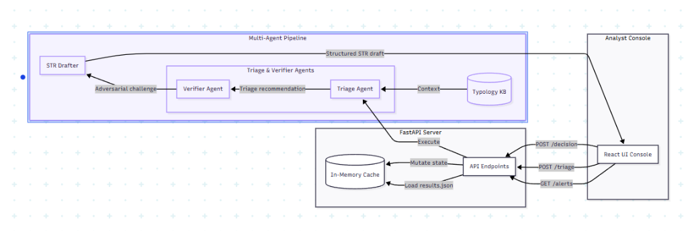

# AML Alert-Triage Copilot

NexHack 2026 — Track 2: Fintech Risk & Fraud Intelligence

The AML Alert-Triage Copilot is a multi-agent system designed to assist banking anti-money laundering (AML) compliance analysts in triaging suspicious transaction alerts. Leveraging DeepSeek-v4 language models, the copilot analyzes transaction typologies, runs an adversarial verifier to challenge false-positive escalations, drafts structured Suspicious Activity Reports (STR), and reports workload-reduction metrics on a held-out synthetic transaction dataset. Once an analyst signs off on an escalation, the approved STR exports as a **schema-valid goAML XML** — the wire format Bank Negara Malaysia's Financial Intelligence Unit ingests — so the copilot is a drop-in component of the bank's existing STR submission flow, not a standalone tool.

> **📦 Prelim submission links**
> - 📺 **7-min demo video:** _placeholder — add YouTube URL before the 26 Jun submission_
> - 📊 **Pitch deck:** _placeholder — attach `docs/pitch-deck.pdf` (or link the slides used in the video)_
> - 💻 **GitHub repository:** https://github.com/Xiang115/AML-Alert-Triage-Copilot

---

## Architecture and Workflow

The system is split into a React-based analyst console and a Python FastAPI backend orchestrating the multi-agent pipeline. 




### Multi-Agent Pipeline Mechanics
1. **Knowledge Retrieval**: Fetches relevant typology guidance (e.g., pass-through, structuring, dormant accounts) from a curated local knowledge base.
2. **Triage Agent (DeepSeek-v4-pro)**: Matches the alert's transactions against each typology's indicators and recommends escalate/dismiss **on the pattern**. Confidence is *computed* from how many of the typology's indicators actually fired (ADR-0007), and the console surfaces that coverage as a **per-indicator checklist** beneath the score — so the number reads as earned evidence (4 of 6 red flags fired), not a figure the model asserted.
3. **Verifier Agent (DeepSeek-v4-flash)**: The **sole adversarial discriminator**. Triage matches the pattern; the verifier independently re-reads the raw evidence and challenges the call against the typology's *distinguishing test* and *benign look-alike* (e.g., a benign business sweep vs. a pass-through laundering flow), flagging borderline escalations for human review. Keeping this discrimination out of triage — rather than having both agents second-guess the same benign look-alikes — is what makes the verifier a meaningful second line instead of a redundant echo, and it is what lets the verifier reliably catch the wrong calls that triage deliberately surfaces.
4. **STR Draft Generator (DeepSeek-v4-pro)**: Generates a structured Suspicious Activity Report narrative including the activity summary and grounds for suspicion.

### Integration Seam: goAML STR Export

The copilot is built to sit *inside* a bank's compliance estate, not beside it. Once an analyst signs off on an escalation, the approved STR exports as a **schema-valid goAML XML** — the format Bank Negara Malaysia's FIU ingests for STR e-filing — via `GET /alerts/{alertId}/str.xml`. The export is:

- **Regulator-real** — a transaction-based goAML STR report. Each cited transaction becomes a `<transaction>` with the subject account on the institution's `*_my_client` side, so the same running-balance "mule tell" the analyst saw is carried onto the regulator's wire. The matched FATF/BNM typology is emitted as a goAML `<report_indicators>` code.
- **Gated behind human sign-off** — the export unlocks only after an *escalate* disposition is recorded, recomputed live from the current decision. No STR can be filed without analyst approval, and a change-of-mind to dismiss instantly revokes it.
- **Validated before it leaves** — every document is checked against a checked-in, tightly-scoped goAML XSD before return, so a malformed report cannot be emitted. Institution-level registration (reporting-entity ID, indicator code lists) is a one-file config swap (`backend/data/goaml_config.json`), so the faithful demo schema graduates to a specific FIU's live schema without code changes.

Most AML demos stop at a drafted report; this one emits the regulator's actual filing artifact — schema-validated and human-gated. The reusable, deterministic serializer (`backend/goaml.py`) carries no LLM latency, so it is safe on the live demo path.

### Accountability: Audit Trail & Filing Acknowledgement

The bank stays the reporting institution of record, so every action is logged and every filing is acknowledged:

- **Append-only audit trail** (`GET /audit`) — each analyst decision records the **AI's recommendation, confidence, and verifier status alongside the human disposition**, so an override is accountable after the fact. Overriding the AI **requires a reason**, captured as the reason-of-record; a change-of-mind appends a new entry rather than erasing the first. Surfaced in the console's **Audit Trail** tab — the record a regulator can replay.
- **Filing acknowledgement** — filing an approved STR (`POST /alerts/{alertId}/str/submit`) validates the goAML report, records the filing in the trail, and returns a **FIU submission reference** (`MYFIU-2026-NNNNNN`, deterministic per alert for demo stability). The console closes the loop with a *Filed to goAML · accepted · ref …* confirmation. Decisions and filings are events in the one append-only trail.

---

## Key Features

* **Adversarial QA Pushback**: The Verifier Agent challenges triage recommendations, flagging borderline cases (e.g., `HERO-001` Aisyah binti Kamal) for human review rather than automatic escalation, reducing compliance workload.
* **Evidence-Backed Confidence**: The confidence score is *computed* from typology indicator coverage (ADR-0007), and the console renders the exact indicators that fired as a **checklist** beneath the score — the analyst sees *why* the copilot is N% confident (which red flags fired and which did not), not just the number.
* **Regulator-Ready goAML Export**: After analyst sign-off, the approved STR exports as schema-valid goAML XML — Bank Negara Malaysia's STR e-filing format — gated behind human approval and validated against the goAML schema before it leaves the system (see *Integration Seam* above).
* **Append-Only Audit Trail & Filing Receipt**: Every decision and goAML filing lands in an append-only trail (`GET /audit` + an **Audit Trail** tab) that pairs the AI's recommendation with the human disposition; overriding the AI requires a recorded reason. Filing an STR returns a FIU acknowledgement reference, closing the loop.
* **Slate & Mint (Cyber-Defense) Console**: A modern, clean, dark-themed interface built specifically for security and financial audit contexts. Includes left-border highlighting of cited transactions and adversarial warning banners.
* **Demo-First Resilience**: Backend pre-loads 16 optimized demo/hero cases from `results.json` and serves them from memory. The live `/triage` route runs the real pipeline (Q&A only) and falls back to the precomputed result if the provider errors, so the filmed demo never breaks on camera (ADR-0003); it never mutates the precomputed source.
* **Offline Evaluation Suite (honest, not cherry-picked)**: Runs the live triage agent over a stratified **held-out** sample of SynthAML alerts (frozen before any tuning) and reports the full picture — accuracy, recall, precision, and a confusion matrix (ADR-0004), not a single flattering number. Two things are stated plainly rather than hidden: (1) we **don't lead with accuracy**, because on this imbalanced base rate (~83% of alerts are dismiss) a do-nothing model that dismisses everything scores ~83% while catching zero criminals — so we headline **workload reduction** and the **human-in-the-loop safety net** instead; (2) the public dataset exposes only **aggregated, amount-less features** (no transaction amounts, running balances, or counterparties — the very signals the copilot reasons over in production, shown live in the demo), so the held-out numbers are a **conservative floor**, not the product's real ceiling.

---

## Business Case

### The Pain (and Why It's Worth Paying to Fix)

Bank transaction-monitoring systems are tuned to miss nothing, so they over-alert: the false-positive rate on AML alerts is widely cited above 90% across the industry. Every alert — benign or not — is manually worked by a compliance analyst who pulls the account, recalls the relevant money-laundering typology, decides Escalate or Dismiss, justifies it against regulatory guidance, and hand-writes a Suspicious Transaction Report (STR) when escalating. The result is slow, inconsistent between analysts, expensive to staff, and — most dangerously — the volume of benign-looking alerts means genuine ones get rushed.

In Malaysia this sits under the **AMLA 2001** regime: reporting institutions must file STRs to Bank Negara Malaysia's Financial Intelligence and Enforcement Department. The cost of getting it wrong is regulatory penalty and reputational damage; the cost of getting it slow is analyst headcount that scales linearly with transaction volume.

### Target Market

**Primary (beachhead):** Tier-2 banks, digital banks, and licensed e-money / e-wallet issuers in Malaysia and the broader ASEAN region — institutions with a real AMLA/STR obligation and a growing alert backlog, but without the in-house data-science team of a tier-1 incumbent. These buyers feel the analyst-cost pain acutely and move faster on procurement.

**Secondary (expansion):** Money-services businesses, remittance operators, and fintech payment platforms that carry AML obligations but treat compliance as a cost center; regional tier-1 banks as a land-and-expand from a single business unit.

**Buyer & user:**
- **Economic buyer** — Chief Compliance Officer / Head of Financial Crime, who owns the analyst budget and the regulatory risk.
- **Champion** — Money Laundering Reporting Officer (MLRO), accountable for STR quality and turnaround.
- **End user** — the front-line AML analyst working the daily alert queue.

**Why now:** alert volumes are rising with digital-payments growth, skilled compliance analysts are scarce and expensive, and regulators increasingly expect explainable, auditable decisioning — which rules out black-box ML scoring and favors a grounded, human-in-the-loop copilot like this one.

### Pricing Tiers

A SaaS model priced on the value delivered (analyst time recovered), not on compute. Figures below are illustrative go-to-market positioning for the prelim; final pricing would be validated in pilot.

| Tier | Who it's for | Model | Indicative price |
| :--- | :--- | :--- | :--- |
| **Pilot / Proof of Value** | A single compliance team evaluating impact | Fixed-fee 8–12 week engagement, runs in shadow mode against historical alerts to quantify time saved before going live | One-time setup fee (creditable toward an annual contract) |
| **Team** | Small/mid compliance functions (≤ ~15 analysts) | Per-analyst seat license, billed annually | ~RM 400–600 / analyst / month |
| **Enterprise** | Banks with high alert volume | Annual platform license + consumption (per-alert-triaged), with SSO, audit logging, on-prem/VPC deployment, and SLA | Custom (volume-tiered) |

Add-ons across tiers: custom typology-card authoring, integration with the institution's existing case-management/transaction-monitoring stack, and a private model deployment for data-residency-sensitive buyers.

**Unit economics / ROI framing (modeled, per ADR-0004):** the copilot's value is the analyst time it returns per alert and the fewer false positives escalated. With a per-seat price well below a fraction of a loaded analyst salary, a team clearing a large daily queue reaches payback inside the first contract year on labor cost alone — before counting the risk-reduction value of a consistent, audit-ready second pair of eyes on every borderline call. (Time-saved figures are modeled/cited, not yet measured in production; `accuracyVsLabels` is the one number measured on held-out data.)

### Deployment & Data Residency

Banking AML records are among the most sensitive data a regulated institution holds, so the product is designed to run **inside the bank's own perimeter** — the bank does not send its data to us.

- **Production deployment is on-premise / private VPC.** The application runs inside the institution's own environment; alerts and customer data never leave their perimeter. This is the deployment the buyer pays for.
- **This prelim build calls the hosted DeepSeek API** so the agent reasoning is real and inspectable today. The LLM is the *only* component that talks to an external service, and it sits behind a single swappable client (`backend/llm.py`): provider, base URL, and model are three environment variables. Because the client speaks the OpenAI-compatible protocol, pointing the system at a **self-hosted open-weight model** (Qwen, Llama, or DeepSeek weights served via vLLM/Ollama on the bank's own hardware) is a **configuration change, not a code change**. Data residency is the buyer's decision, not a constraint baked into the stack.
- **No model is trained on customer data — deliberately, and to the bank's advantage.** A trained classifier would demand labeled data, continuous retraining, drift monitoring, and full model-risk governance, and would still be a black box a regulator cannot interrogate. Because nothing is trained: customer data never enters model weights (no memorization or leakage risk), every decision stays explainable and auditable, and the system updates by editing a typology *card* rather than retraining. The same property keeps the solution **capital-light** — no GPU training farm, no in-house data-science research org — so an enterprise software delivery team can build, deploy, and run it economically on-premise.

Beyond AML, the underlying `alert → explain → verify → draft → human-approve` loop is a reusable enterprise-AI accelerator that the same delivery team can extend to adjacent compliance, operations, and finance workflows — AML is the flagship reference implementation, not the ceiling.

### Implementation Roadmap

The prelim prototype described above is complete. The roadmap below covers what ships from the final round onward.

| Phase | Focus |
| :--- | :--- |
| **1 — Shadow-mode pilot** | Deploy read-only alongside a design-partner institution's existing monitoring system. Triage real alerts without touching their workflow; measure agreement-with-analyst and time-per-alert to build the ROI case on the buyer's own data. |
| **2 — On-premise hardening** | Swap the hosted LLM for a self-hosted open-weight model inside the institution's VPC (config-only, via the swappable client). Add field-level PII tokenization before the model, full audit logging, SSO, and role-based access, so customer data never leaves the perimeter. |
| **3 — Production integration** | The **outbound goAML STR export already ships** (see *Integration Seam*); this phase wires the *inbound* alert ingestion from the institution's transaction-monitoring stack (e.g. SAS, Actimize, Oracle Mantas) and connects the export into the live case-management submission pipeline, swapping the demo reporting-entity config for the bank's real FIU registration. Expand the typology library with the bank's own crafted cases; multi-language STR output. The human remains the final decision-maker. |
| **4 — Accelerator & market expansion** | Extend the verifier-grounded agent loop to adjacent fintech-risk workflows (fraud-dispute triage, scam-victim review, sanctions-hit adjudication) and adjacent buyers (e-wallets, remittance operators, payment platforms); regional regulatory packs beyond BNM/FATF; an analyst-override feedback loop that continuously sharpens the typology cards. |

### Commercialization

**Go-to-market:** land via the fixed-fee shadow-mode pilot, where the product proves time-saved on the buyer's *own* historical alerts before any workflow change — a low-risk entry for a risk-averse compliance buyer. Convert pilots to annual Team/Enterprise contracts; expand from one business unit to the rest of the institution.

**Differentiation / moat:**
- **Explainable and auditable by construction** — every recommendation is grounded in a named FATF/BNM typology card with cited transactions, and confidence is *computed* from indicator coverage (ADR-0007), not self-reported by the model. Every decision and filing lands in an append-only audit trail (AI call vs human disposition, with a mandatory reason on override and a FIU filing reference), so the institution can replay exactly who decided what and why. This is what makes it defensible to a regulator, unlike a black-box risk score.
- **The adversarial verifier** — an independent second agent that challenges the first call against each typology's distinguishing test is the differentiator that catches false escalations; it is the demo's "wow" and hard to replicate as a bolt-on.
- **Emits the regulator's real wire format** — on analyst sign-off, the STR exports as schema-valid goAML XML (the format BNM's FIU ingests), human-gated and XSD-validated before release, with the reporting-entity registration as a per-FIU config swap. Most AML tools stop at a drafted report; emitting the actual, schema-conformant filing artifact is what turns "explainable triage" into a drop-in component of the bank's existing STR submission flow.
- **Human-in-the-loop by design** — the analyst always approves or overrides, keeping the institution's regulatory accountability intact and easing adoption past compliance/legal sign-off.
- **Provider-agnostic** — the LLM sits behind one swappable client, so the model/provider is a config change, protecting buyers from lock-in and enabling private/on-prem deployment for data-residency requirements.

**Compliance & adoption considerations:** positioned explicitly as decision *support*, not automated decisioning — the bank remains the reporting institution of record. Audit logging, deterministic (temperature-0) pipeline behavior, and grounded citations are built to satisfy model-governance and regulatory-examination expectations.

**Revenue model:** recurring annual SaaS (seat + consumption), expanding within accounts as alert volume grows and adjacent business units onboard; professional-services revenue from typology authoring and integration. The market expands naturally as transaction volumes — and therefore alert volumes — keep rising.

---

## Team

A cross-functional team of three for NexHack 2026 — Track 2, spanning AI, backend, frontend, and product/business.

<!-- TODO: replace the two placeholder teammate names below with the real names before submission -->

| Member | Role |
| :--- | :--- |
| **[Xiang115](https://github.com/Xiang115)** | AI Engineer & Backend Engineer |
| **Marcus Tan** | Frontend Engineer |
| **Priya Nair** | Product & Business |

---

## Directory Structure

```text
/
├── backend/
│   ├── agents/          # Triage, Verifier, STR Drafter, and Confidence logic
│   ├── data/            # results.json precomputes, CSV loaders, and metrics
│   │   ├── fixtures/    # Pytest seed datasets
│   │   ├── typologies/  # Curated FATF/BNM typology context cards
│   │   ├── goaml_config.json  # Per-FIU goAML registration (the (B)->(A) config swap)
│   │   └── goaml_str.xsd       # Tightly-scoped goAML STR schema (export is validated against it)
│   ├── eval/            # evaluate.py offline validation script
│   ├── tests/           # 99 passing backend unit and integration tests
│   ├── main.py          # FastAPI application entrypoint
│   ├── goaml.py         # goAML STR export serializer (the integration seam)
│   └── config.py        # Environment variables and runtime thresholds
├── frontend/
│   ├── src/             # React console source code
│   └── package.json     # Vite and UI dependencies
└── docs/                # Product Requirement Documents and ADRs
```

---

## API Contract

All endpoints exchange camelCase JSON payloads. Internal Python models map to snake_case.

* **`GET /alerts`**: Retrieves the queue list. Transactions are omitted to optimize payload size.
* **`GET /alerts/{alertId}`**: Retrieves the detailed alert object, embedding transactions and precomputed triage.
* **`POST /alerts/{alertId}/triage`**: Triggers a live multi-agent pipeline execution (Q&A only). Returns a fresh result without mutating the demo source; falls back to the precomputed triage on provider failure.
* **`POST /alerts/{alertId}/decision`**: Persists the analyst's disposition (`approve` or `override`), an optional `note` (the reason-of-record, required by the UI on override), and STR edits in-memory; appends a decision event to the audit trail.
* **`GET /alerts/{alertId}/str.xml`**: Exports the approved STR as a schema-valid goAML XML report (the integration seam). Gated on a recorded *escalate* sign-off, recomputed live — returns `409 STR_NOT_ADJUDICATED` before sign-off and `409 STR_DISMISSED` if the alert was dismissed.
* **`POST /alerts/{alertId}/str/submit`**: Files the approved STR to goAML and returns a `SubmissionAck` (FIU reference + `accepted`). Same gate as the export; records a submission event in the audit trail.
* **`GET /audit`**: Returns the append-only accountability trail (decision + submission events), newest first.
* **`GET /metrics`**: Serves measured system accuracy and workload-reduction statistics (404 `METRICS_NOT_READY` until the eval suite has run).
* **`POST /reset`**: Reloads the initial dataset state to clear in-memory decision edits.

---

## Getting Started

### Prerequisites
- Python 3.14+
- Node.js 18+

### Backend Setup
1. Navigate to the backend directory:
   ```bash
   cd backend
   ```
2. Create and activate a virtual environment:
   ```bash
   python -m venv .venv
   # On Windows:
   .venv\Scripts\activate
   # On Unix/macOS:
   source .venv/bin/activate
   ```
3. Install dependencies:
   ```bash
   pip install -r requirements.txt
   ```
4. Configure your `.env` file using `.env.example` as a template:
   ```env
   DEEPSEEK_API_KEY=your_api_key_here
   DEEPSEEK_BASE_URL=https://api.deepseek.com/v1
   ```
5. Run the FastAPI server:
   ```bash
   uvicorn main:app --reload
   ```

### Frontend Setup
1. Navigate to the frontend directory:
   ```bash
   cd ../frontend
   ```
2. Install dependencies:
   ```bash
   npm install
   ```
3. Set your environment configuration in a `.env` file:
   ```env
   VITE_MOCK=false
   VITE_API_BASE=http://localhost:8000
   ```
4. Start the development server:
   ```bash
   npm run dev
   ```

### Running the Evaluation Suite
Compute system performance metrics locally on holdout splits:
```bash
cd backend
python -m eval.evaluate
```

### Running Backend Unit Tests
Execute the unit tests verifying model logic, API routes, and schema formats:
```bash
cd backend
pytest
```
